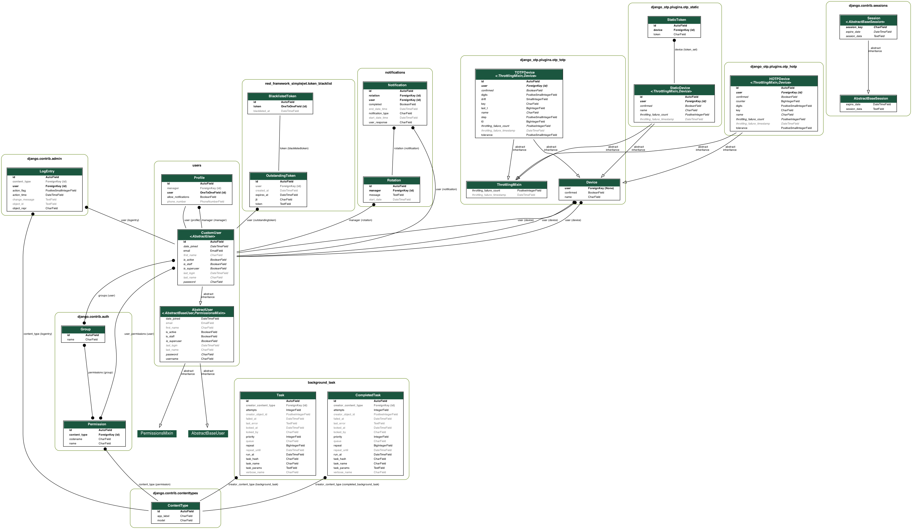

# caller-app

## Authors:

[Joe Lee](https://github.com/josephlee3454), [Lee-Roy King](https://github.com/leeroywking), [Leo Kukharau](https://github.com/LeoKuhorev), [Richard Whitehead](https://github.com/RichWhitehead), [William Koger]()

## GETTING STARTED:

### Development

- in the project directory
  - `poetry shell` to start your virtual environment
  - `poetry install` to install dependencies
  - create .env file with listed <a href="#env">below</a> variables and save it into 'server' directory
  - `python manage.py runserver` - to run server
- navigate to the `frontend` directory and run: - `yarn install` to install node dependencies - `yarn start` to start development server
  Now you have the back end running on `localhost:8000` and the front end running on `localhost:3000`

### Production (using Docker)

- navigate to the `frontend` directory and run `yarn build`
- navigate to the root and run `docker-compose up --build -d` to run the server, then navigate to `localhost` in your browser

If you're having troubles with installing `psycopg2` try this solution (for Mac users):  
`brew install openssl`  
`export LIBRARY_PATH=$LIBRARY_PATH:/usr/local/opt/openssl/lib/`  
`pip3 install psycopg2`

###  ENV variables:

SECRET_KEY=secret key for the app (typically 50-characters long string)  
DEBUG=should be set to True in development  
ALLOWED_HOSTS=localhost,127.0.0.1 (for testing)  
DB_NAME=name of the DB (see slack)  
DB_USER=DB username(see slack)  
DB_PASS=DB password(see slack)  
DB_HOST=DB host (see slack)  
DB_PORT=DB port(see slack)  
CORS_ALLOWED_ORIGINS=make sure to include `http://localhost:3000,http://localhost`  
TWILIO_SID=Twilio credentials  
TWILIO_AUTH=Twilio credentials  
TWILIO_NUMBER=Twilio credentials  
DEPLOYED_URL=deployed site URL (for Twilio)

## 2FA

Django admin page is protected by 2 factor authentication. To access this page a user must provide a dynamically generated token that is bound to their trusted device.
To get the token you will need to use [Google authenticator app](https://support.google.com/accounts/answer/1066447?co=GENIE.Platform%3DAndroid&hl=en)

## Credentials

|        Email         | Password  |   Role    |           Admin page 2FA Barcode            |
| :------------------: | :-------: | :-------: | :-----------------------------------------: |
|  admin@company.com   | test12345 | superuser |      |
| manager@company.com  | test12345 |   staff   |  |
| leo@company.com      | test12345 |   user    |                     N/A                     |
| will@company.com     | test12345 |   user    |                     N/A                     |
| joe@company.com      | test12345 |   user    |                     N/A                     |
| lee@company.com      | test12345 |   user    |                     N/A                     |
| rich@company.com     | test12345 |   user    |                     N/A                     |

## API:

`/` - landing page - serves React frontend app;

`login` - login page;  
`logout` - logout page;  
`profile` - employee profile page;  
`about`- about us page;  
`notification-history` - employee notification history page;  
`rotation` - rotation history page;  
`start-rotation` - start rotation page;  
`rotation-detail/:id` - rotation details page

### API Routes:
`api-auth/` - authorization for browsable API interface;

`api/v1/user/login` - accepts email and password and returns access and refresh JSON Web Tokens;  
`api/v1/user/token/refresh` - accepts refresh token and if valid returns new generated access and refresh tokens;  
`api/v1/user/logout/blacklist` - accepts a refresh token and adds it to black list;  
`api/v1/user/list` - returns a list of users that have current authenticated user set as their manager. Accepts `GET` request;  
`api/v1/user/profile` - returns profile information for the authenticated user. Accepts `GET` and `PUT` requests;

`api/v1/start_rotation` - accepts a message via `POST` request from the authenticated user with manager privileges and creates a rotation instance that contains notifications for all manager's employees that allowed notifications;

`api/v1/notification/notification-history` - returns all notification for the authenticated user. Accepts `GET` request;  
`api/v1/notification/rotation-history` - returns all rotations for the authenticated user with manager privileges. Accepts `GET` request;  
`api/v1/notification/rotation/<rotation_id>` - returns all notification for the given rotation. Accepts `GET` request;

`admin/` - site admin page;

## Additional information:

[Requirements](./docs/requirements.md)  
[Project Management](https://github.com/401n1-midterm/penny-pincher/projects/1)

### DB Schema (click to expand):

### Dependency Documentation:

#### Backend dependencies:

- [Django](https://docs.djangoproject.com/en/3.1/)
- [Django Rest Framework](https://www.django-rest-framework.org/)
- [Django Cors-Headers](https://pypi.org/project/django-cors-headers/)
- [Django Environ](https://pypi.org/project/django-environ/)
- [Gunicorn](https://pypi.org/project/gunicorn/)
- [Whitenoise](https://pypi.org/project/whitenoise/)
- [Psycopg2](https://pypi.org/project/psycopg2/)
- [Django Rest Framework-Simple JWT](https://pypi.org/project/djangorestframework-simplejwt/)
- [Autopep8](https://pypi.org/project/autopep8/)
- [Twilio](https://www.twilio.com/)
- [Django OTP](https://pypi.org/project/django-otp/)
- [QR Code](https://pypi.org/project/qrcode/)
- [Django Phonenumber Field](https://pypi.org/project/django-phonenumber-field/)
- [Phonenumbers](https://pypi.org/project/phonenumbers/)
- [Django Background Tasks](https://pypi.org/project/django-background-tasks/)

#### Frontend dependencies:
- [material-ui](https://material-ui.com/getting-started/installation/)
- [axios](https://www.npmjs.com/package/axios)
- [formik](https://www.npmjs.com/package/formik)
- [formik-material-ui](https://www.npmjs.com/package/formik-material-ui)
- [react](https://www.npmjs.com/package/react)
- [react-dom](https://www.npmjs.com/package/react-dom)
- [react-router-dom](https://www.npmjs.com/package/react-router-dom)
- [react-scripts](https://www.npmjs.com/package/react-scripts)

